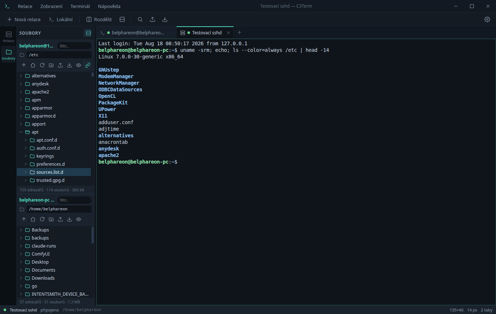
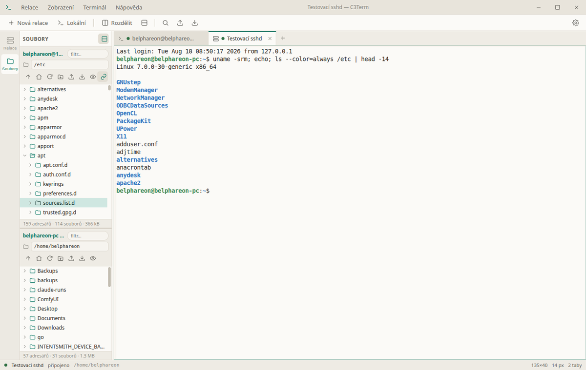

# C3Term

**Verze:** 1.0.0

SSH a SFTP klient pro Linux v duchu MobaXtermu: vlevo adresářový strom s drag &
drop, vpravo terminál s taby a rozdělenými panely, nahoře správce uložených
relací. Postaveno na Electronu, xterm.js a ssh2 — bez X11 forwardingu a bez
dalších závislostí.


---

## Instalace

```bash
cd ~/Projects/c3term
./install.sh
```

Skript doinstaluje závislosti, sestaví rozhraní a zaregistruje aplikaci pro
přihlášeného uživatele:

| Co | Kam |
|---|---|
| spouštěč | `~/.local/bin/c3term` |
| položka v nabídce | `~/.local/share/applications/c3term.desktop` |
| ikony | `~/.local/share/icons/hicolor/*/apps/c3term.png` |

**Připnutí na panel Kubuntu:** otevřete nabídku aplikací, najděte *C3Term*
(kategorie Internet / Síť), pravé tlačítko → *Přidat do panelu*. Aplikace hlásí
`WM_CLASS = C3Term`, takže KDE spáruje běžící okno se spouštěčem správně.

Odinstalace: `./uninstall.sh` (nastavení v `~/.config/c3term` zůstává).

### Distribuční balíčky

```bash
npm run dist      # přenositelný AppImage do release/
```

Chcete-li i `.deb`, doplňte do `package.json` pole `homepage` a `author.email`
(Debian je vyžaduje pro pole *Homepage* a *Maintainer* v control souboru)
a spusťte `npm run dist:deb`.

---

## Co umí

### Adresářový strom s drag & drop

Levý panel je plnohodnotný strom: adresáře se rozbalují na místě, obsah se
načítá až když je potřeba. Ovládání odpovídá zvyklostem správců souborů —
`F5` obnovit, `F2` přejmenovat, `Delete` smazat, `Ctrl+A` vybrat vše, `Backspace`
o úroveň výš, šipky pro pohyb, `Ctrl`/`Shift` pro vícenásobný výběr.

Panel může být rozdělený na dvě části (tlačítko v záhlaví **Soubory**): nahoře
server, dole váš počítač. Přetažením mezi nimi se soubory přenášejí.

| Odkud | Kam | Co se stane |
|---|---|---|
| Dolphin / plocha | panel serveru | upload přes SFTP |
| lokální panel | panel serveru | upload |
| panel serveru | lokální panel | download |
| panel serveru | panel jiného serveru | přímý přenos mezi servery |
| uvnitř jednoho serveru | jiný adresář | přesun (`rename`, bez kopírování dat) |
| panel serveru | Dolphin / plocha | stažení na pozadí přes dočasné lokální URL |
| lokální panel | Dolphin / plocha | běžné systémové přetažení souboru |

Podržený `Ctrl` při puštění vynutí kopii místo přesunu. Kolize názvů řeší dialog
s volbami *Přepsat / Přejmenovat / Přeskočit / Zrušit* a přepínačem „použít pro
všechny další".

Přenosy mají v dolní části okna proužek s průběhem, rychlostí a tlačítkem pro
zrušení. Adresáře se přenášejí rekurzivně včetně práv.

### Terminál

- **Označení myší kopíruje** do schránky (jako v MobaXtermu / PuTTY).
- **Pravé tlačítko vkládá** — nebo otevře kontextové menu, podle nastavení.
- **Prostřední tlačítko** vloží primární výběr X11.
- Víceřádkové vložení se pro jistotu potvrzuje náhledem.
- Vyhledávání v historii (`Ctrl+Shift+F`) se zvýrazněním nálezů.
- `Ctrl` + kolečko myši mění velikost písma.
- Klikací odkazy, plná paleta 256 barev i true color, GPU vykreslování.

### Taby a rozdělené panely

Tab lze přejmenovat (dvojklik), přetáhnout na jiné místo, duplikovat nebo znovu
připojit. Každý tab se dá rozdělit vodorovně i svisle, a to opakovaně — vzniká
strom panelů s posuvnými předěly. Barevná tečka u názvu ukazuje stav relace.

Když relace spadne, panel nabídne **Znovu připojit** místo toho, aby zmizel.


### Uložené relace

Relace se skládají do složek (`Produkce/Web`), dají se filtrovat a spouštět
dvojklikem. Podporované způsoby přihlášení:

- **SSH agent** nebo výchozí klíče (`SSH_AUTH_SOCK`)
- **soubor s privátním klíčem** (passphrase se doptá, volitelně zapamatuje)
- **heslo**
- **keyboard-interactive** — funguje i dvoufaktorové ověření, dialog zobrazí
  přesně to, na co se server ptá
- **jump host** — připojení přes jinou uloženou relaci

V liště je pole pro rychlé připojení: napište `user@host:port` a stiskněte Enter.

Aplikace umí i odkazy `ssh://user@host:port/cesta` — otevřou se v novém tabu,
a pokud pro daný server existuje uložená relace, použije se její nastavení.

### Sledování pracovního adresáře

Strom souborů umí následovat `cd` v terminálu. U lokálních relací se pracovní
adresář čte z `/proc`, u SSH relací se po přihlášení nastaví hook, který ho hlásí
sekvencí OSC 7. Instalace hooku není v terminálu vidět — výstup se do jejího
dokončení jen sbírá a řádek s příkazem se z něj vystřihne.

Vypnout lze v *Nastavení → SSH → Sledovat pracovní adresář*.

### Motivy

Čtyři motivy, přepínají se za běhu a pamatují se:

| | |
|---|---|
|  **MobaXterm Dark** — tmavé rozhraní, černý terminál |  **C3 Nocturne** — vlastní návrh, tyrkysový akcent |
|  **MobaXterm Classic** — světlé rozhraní, černý terminál |  **C3 Daylight** — vlastní světlý návrh |

### Nastavení


Vše se ukládá okamžitě do `~/.config/c3term/settings.json`. Nastavit lze font a
jeho velikost, výšku řádku, tvar a blikání kurzoru, délku historie, chování myši
a schránky, SSH keepalive a timeouty, zobrazení skrytých souborů, externí editor
a další. Tlačítko *Obnovit výchozí* vrátí nastavení, uložené relace nechá být.

---

## Klávesové zkratky

| Zkratka | Akce |
|---|---|
| `Ctrl+Shift+T` | nový lokální terminál |
| `Ctrl+Shift+N` | nová uložená relace |
| `Ctrl+Shift+W` | zavřít tab |
| `Ctrl+Tab` / `Ctrl+Shift+Tab` | další / předchozí tab |
| `Alt+1` … `Alt+9` | přepnout na tab podle čísla |
| `Ctrl+Shift+E` / `Ctrl+Shift+O` | rozdělit svisle / vodorovně |
| `Ctrl+Shift+C` / `Ctrl+Shift+V` | kopírovat / vložit |
| `Ctrl+Shift+F` | hledat v terminálu |
| `Ctrl` + `+` / `-` / `0` | velikost písma |
| `Ctrl+B` | skrýt postranní panel |
| `Ctrl+,` | nastavení |
| `F11` | režim bez rozhraní |
| `F5`, `F2`, `Delete` | v panelu souborů: obnovit, přejmenovat, smazat |

---

## Bezpečnost

**Otisky klíčů serverů.** C3Term si vede vlastní `known_hosts.json`. Při prvním
připojení ukáže otisk k potvrzení; když se otisk později změní, spojení zastaví
a upozorní.


**Hesla a passphrase.** Ukládají se jen na výslovné přání a jen zašifrované
klíčenkou plochy (KWallet/libsecret přes Electron `safeStorage`). Pokud klíčenka
není dostupná, heslo se neuloží vůbec — aplikace se raději zeptá znovu, než aby
ho psala na disk v čitelné podobě. Zapomenout je lze v kontextovém menu relace.

**Izolace rozhraní.** Okno běží se zapnutou izolací kontextu, bez integrace Node
a v sandboxu; do rozhraní vede jen úzké IPC rozhraní definované v
`src/preload/preload.js`.

Soubory s nastavením mají práva `600`, adresář `700`.

---

## Kde co je

```
~/.config/c3term/
├── settings.json      nastavení
├── sessions.json      uložené relace
├── secrets.json       zašifrovaná hesla (jen se souhlasem)
├── known_hosts.json   otisky klíčů serverů
└── state.json         otevřené taby pro obnovu po startu
```

---

## Vývoj

```bash
npm install            # závislosti (node-pty se přeloží pro Electron)
npm start              # sestavit rozhraní a spustit
npm run dev            # totéž s ladicím výstupem
npm run watch:renderer # průběžné sestavování rozhraní
npm run dist           # .deb + AppImage
```

`C3TERM_DEBUG=1` vypíše celý průběh SSH spojení — užitečné při řešení potíží
s přihlášením. `C3TERM_DEVTOOLS=1` otevře vývojářské nástroje.

Popis vnitřního uspořádání je v [docs/ARCHITECTURE.md](docs/ARCHITECTURE.md).

---

## Řešení potíží

**Okno se neotevře a v konzoli je `Cannot read properties of undefined`** —
prostředí má nastavenou proměnnou `ELECTRON_RUN_AS_NODE` (dědí se například
z terminálu uvnitř VS Code). Spouštěč `bin/c3term` ji odstraňuje sám; pokud
spouštíte Electron ručně, použijte `env -u ELECTRON_RUN_AS_NODE`.

**Strom nenásleduje `cd` na serveru** — hook se instaluje jen pro shelly
kompatibilní s bash/zsh. U ostatních panel zůstane tam, kam ho nasměrujete ručně.

**Přetažení ze serveru do Dolphinu nic neudělá** — mechanismus vyžaduje X11
(sezení Wayland ho nemá). Spolehlivá cesta je zapnout lokální panel a přetáhnout
soubory do něj, nebo použít *Stáhnout do…* z kontextového menu.

**Připojení končí hláškou o uzavření před přihlášením** — server odmítl spojení
ještě před ověřením; typicky jde o limit souběžných přihlášení. Zkuste to znovu,
případně spusťte s `C3TERM_DEBUG=1` a podívejte se na průběh.

---

## Licence

MIT
