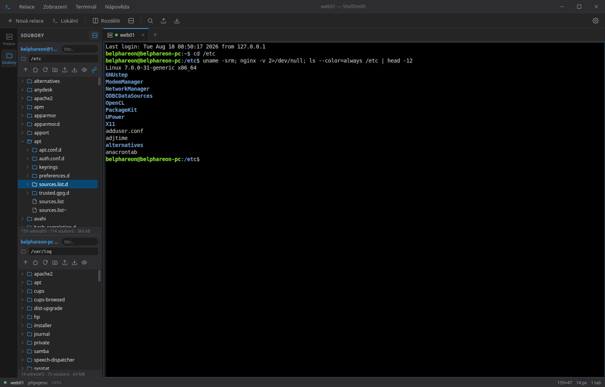
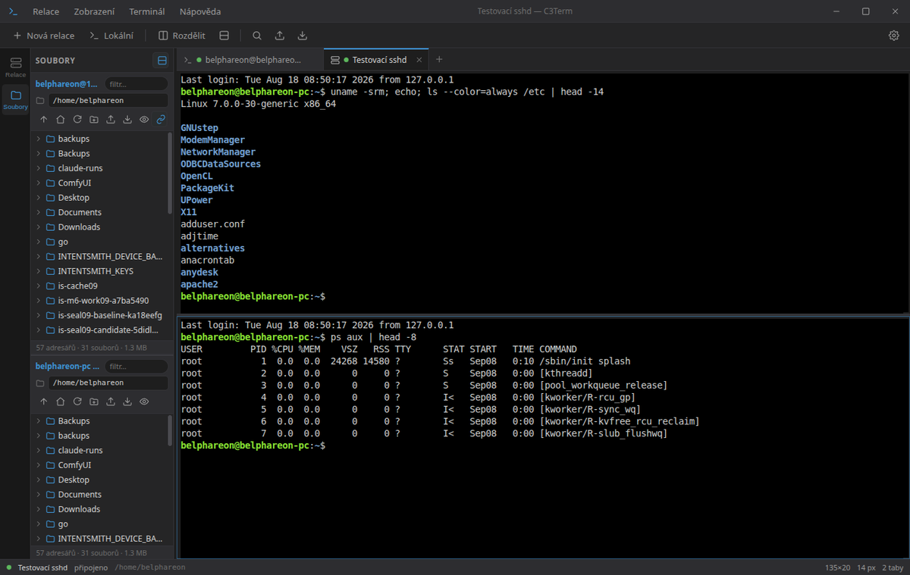
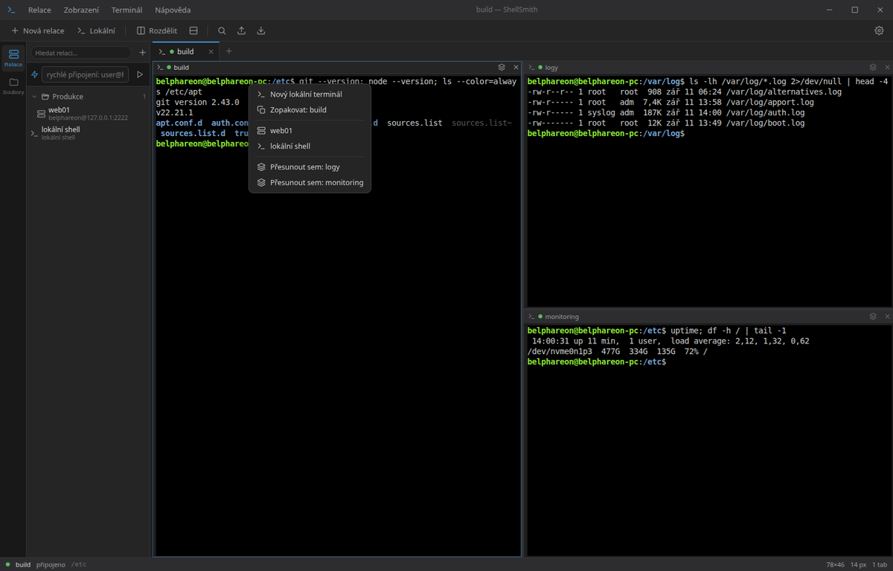
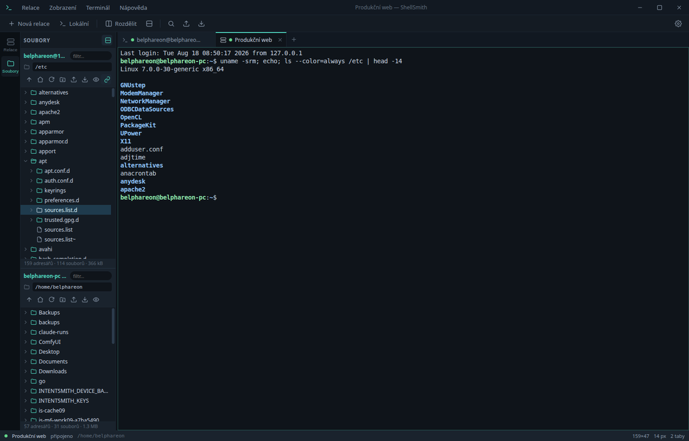
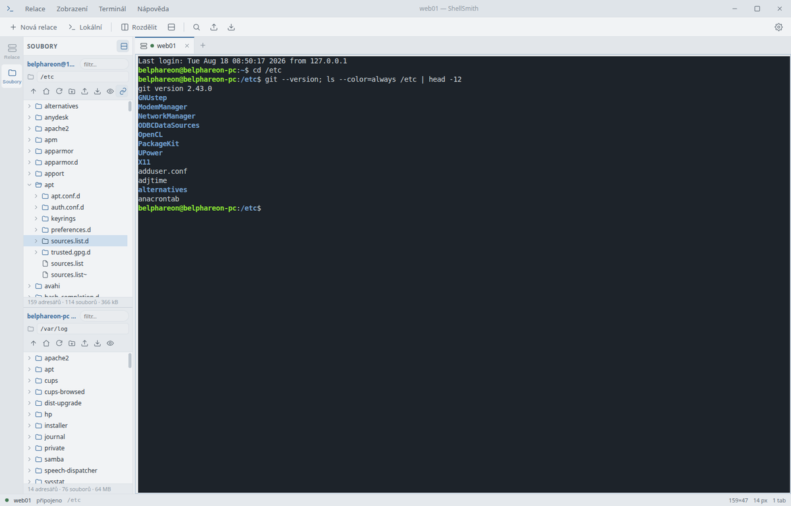
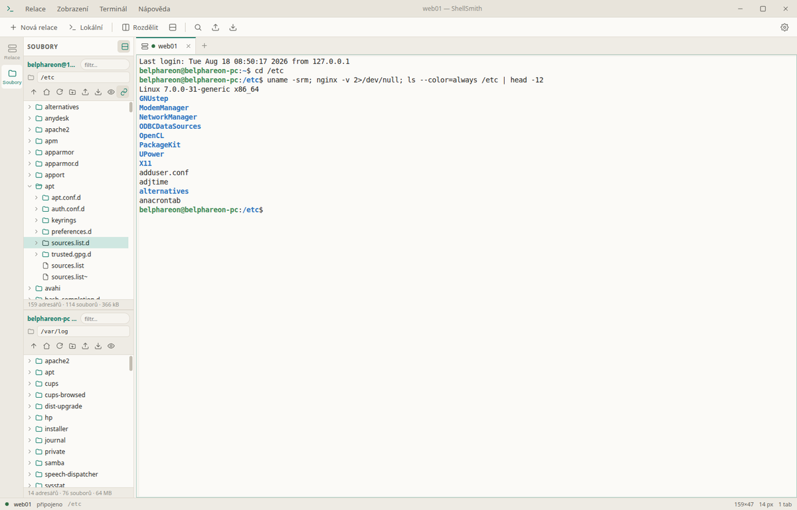
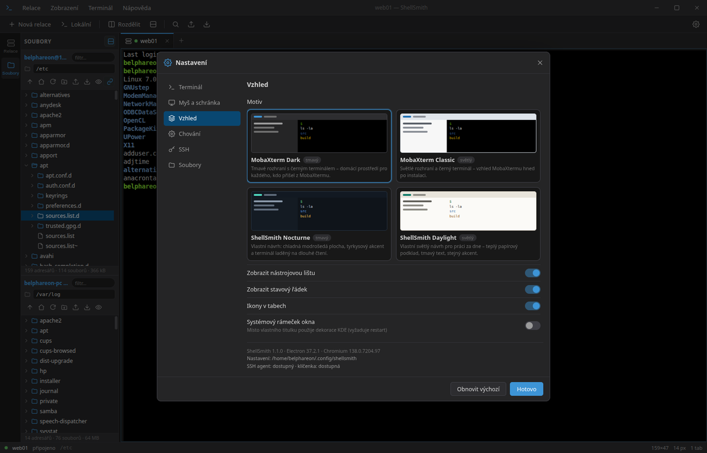
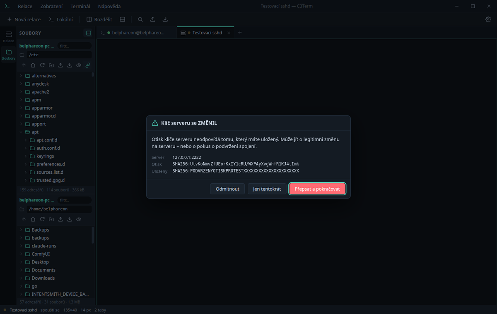

# ShellSmith

**Verze:** 1.1.2

SSH a SFTP klient pro Linux v duchu MobaXtermu: vlevo adresářový strom s drag &
drop, vpravo terminál s taby a rozdělenými panely, nahoře správce uložených
relací. Postaveno na Electronu, xterm.js a ssh2 — bez X11 forwardingu a bez
dalších závislostí.



---

## Instalace

```bash
cd ~/Projects/shellsmith
./install.sh
```

Skript doinstaluje závislosti, sestaví rozhraní a zaregistruje aplikaci pro
přihlášeného uživatele:

| Co | Kam |
|---|---|
| spouštěč | `~/.local/bin/shellsmith` |
| položka v nabídce | `~/.local/share/applications/shellsmith.desktop` |
| ikony | `~/.local/share/icons/hicolor/*/apps/shellsmith.png` |

**Připnutí na panel Kubuntu:** otevřete nabídku aplikací, najděte *ShellSmith*
(kategorie Internet / Síť), pravé tlačítko → *Přidat do panelu*. Aplikace hlásí
`WM_CLASS = shellsmith` a desktopové jméno `shellsmith.desktop`, takže KDE
spáruje běžící okno se spouštěčem. Po aktualizaci instalace ze zdrojů spusťte
znovu `./install.sh`, aby se obnovila také položka nabídky.

Odinstalace: `./uninstall.sh` (nastavení v `~/.config/shellsmith` zůstává).

### Distribuční balíčky

```bash
npm run dist      # AppImage i .deb do release/
npm run dist:deb  # jen .deb
```

---

## Co umí

### Adresářový strom s drag & drop

Levý panel je plnohodnotný strom: adresáře se rozbalují na místě, obsah se
načítá až když je potřeba. Ovládání odpovídá zvyklostem správců souborů —
`F5` obnovit, `F2` přejmenovat, `Delete` smazat, `Ctrl+A` vybrat vše, `Backspace`
o úroveň výš, šipky pro pohyb, `Ctrl`/`Shift` pro vícenásobný výběr.

Panel může být rozdělený na dvě části (tlačítko v záhlaví **Soubory**): nahoře
server, dole váš počítač. Přetažením mezi nimi se soubory přenášejí.

| Odkud | Kam | Co se stane |
|---|---|---|
| Dolphin / plocha | panel serveru | upload přes SFTP |
| lokální panel | panel serveru | upload |
| panel serveru | lokální panel | download |
| panel serveru | panel jiného serveru | přímý přenos mezi servery |
| uvnitř jednoho serveru | jiný adresář | přesun souborů přejmenováním, s kontrolou kolizí |
| panel serveru | Dolphin / plocha | stažení na pozadí přes dočasné lokální URL |
| lokální panel | Dolphin / plocha | běžné systémové přetažení souboru |

Podržený `Ctrl` při puštění vynutí kopii místo přesunu. Kolize názvů řeší dialog
s volbami *Přepsat / Přejmenovat / Přeskočit / Zrušit* a přepínačem „použít pro
všechny další".

Přenosy mají v dolní části okna proužek s průběhem, rychlostí a tlačítkem pro
zrušení. Probíhají postupně. Adresáře se přenášejí rekurzivně včetně přístupových
práv nově vytvořených adresářů; symbolické odkazy se zachovávají jako odkazy.
Přeskočené položky jsou ve výsledku označené a při přesunu se zdroj nemaže.

Kopie se nejprve zapisuje do dočasného souboru ve stejném cílovém adresáři.
Původní cílový soubor se nahradí až po dokončení. Pro přepsání přes SFTP musí
server podporovat `posix-rename@openssh.com` (OpenSSH jej podporuje). Pokud
rozšíření chybí, přenos přepis odmítne; použijte volbu *Přejmenovat*.

### Terminál

- **Označení myší kopíruje** do schránky (jako v MobaXtermu / PuTTY).
- **Pravé tlačítko vkládá** — nebo otevře kontextové menu, podle nastavení.
- **Prostřední tlačítko** vloží primární výběr X11.
- Víceřádkové vložení se pro jistotu potvrzuje náhledem.
- Vyhledávání v historii (`Ctrl+Shift+F`) se zvýrazněním nálezů.
- `Ctrl` + kolečko myši mění velikost písma.
- Klikací odkazy, plná paleta 256 barev i true color, GPU vykreslování.

### Taby a rozdělené panely

Tab lze přejmenovat (dvojklik), přetáhnout na jiné místo, duplikovat nebo znovu
připojit. Každý tab se dá rozdělit vodorovně i svisle, a to opakovaně — vzniká
strom panelů s posuvnými předěly. Barevná tečka u názvu ukazuje stav relace.

Jakmile je tab rozdělený, dostane každý panel vlastní hlavičku: název relace,
její stav, přepínač obsahu a **křížek pro zavření**. Rozdělení tak jde kdykoli
vzít zpět jedním kliknutím — nemusíte ukončovat shell.



**Co se v panelu zobrazí, si vybíráte.** Rozdělení přes nástrojovou lištu,
kontextové menu nebo přepínač v hlavičce otevře nabídku:

- **Nový lokální terminál**
- **Zopakovat** — další připojení téže relace
- **kterákoli uložená relace** — připojí se rovnou do nové poloviny
- **Přesunout sem** — vezme terminál, který už běží v jiném tabu, i s jeho
  historií a spojením, a přesune ho do splitu; opuštěný tab se sám zavře



Přepínač v hlavičce panelu navíc umí **prohodit dva panely** (i napříč taby)
a **odpojit panel zpět do vlastního tabu**. Relace přitom běží dál — přesouvá
se jen její místo na obrazovce.

Když relace spadne, panel nabídne **Znovu připojit** místo toho, aby zmizel.

### Uložené relace

Relace se skládají do složek (`Produkce/Web`), dají se filtrovat a spouštět
dvojklikem. Podporované způsoby přihlášení:

- **SSH agent** (`SSH_AUTH_SOCK`); klíč bez agenta vyberte jako soubor níže
- **soubor s privátním klíčem** (passphrase se doptá, volitelně zapamatuje)
- **heslo**
- **keyboard-interactive** — funguje i dvoufaktorové ověření, dialog zobrazí
  přesně to, na co se server ptá
- **jump host** — připojení přes jinou uloženou relaci

V liště je pole pro rychlé připojení: napište `user@host:port` a stiskněte Enter.

Aplikace umí i odkazy `ssh://user@host:port/cesta` — otevřou se v novém tabu,
a pokud pro daný server existuje uložená relace, použije se její nastavení.

### Sledování pracovního adresáře

Strom souborů umí následovat `cd` v terminálu. U lokálních relací se pracovní
adresář čte z `/proc`, u SSH relací se po přihlášení nastaví hook, který ho hlásí
sekvencí OSC 7. Instalace hooku není v terminálu vidět — výstup se do jejího
dokončení jen sbírá a řádek s příkazem se z něj vystřihne.

Vypnout lze v *Nastavení → SSH → Sledovat pracovní adresář*.

### Motivy

Čtyři motivy, přepínají se za běhu a pamatují se:

| | |
|---|---|
|  **MobaXterm Dark** — tmavé rozhraní, černý terminál |  **ShellSmith Nocturne** — vlastní návrh, tyrkysový akcent |
|  **MobaXterm Classic** — tlumené šedé rozhraní, tmavý terminál |  **ShellSmith Daylight** — vlastní světlý návrh |

### Nastavení



Vše se ukládá okamžitě do `~/.config/shellsmith/settings.json`. Nastavit lze font a
jeho velikost, výšku řádku, tvar a blikání kurzoru, délku historie, chování myši
a schránky, SSH keepalive a timeouty, zobrazení skrytých souborů, externí editor
a další. Tlačítko *Obnovit výchozí* vrátí nastavení, uložené relace nechá být.

---

## Klávesové zkratky

| Zkratka | Akce |
|---|---|
| `Ctrl+Shift+T` | nový lokální terminál |
| `Ctrl+Shift+N` | nová uložená relace |
| `Ctrl+Shift+W` | zavřít panel (poslední panel zavře tab) |
| `Ctrl+Shift+Q` | zavřít celý tab |
| `Ctrl+Tab` / `Ctrl+Shift+Tab` | další / předchozí tab |
| `Alt+1` … `Alt+9` | přepnout na tab podle čísla |
| `Ctrl+Shift+E` / `Ctrl+Shift+O` | rozdělit svisle / vodorovně (zopakuje aktuální relaci) |
| `Ctrl+Shift+C` / `Ctrl+Shift+V` | kopírovat / vložit |
| `Ctrl+Shift+F` | hledat v terminálu |
| `Ctrl` + `+` / `-` / `0` | velikost písma |
| `Ctrl+B` | skrýt postranní panel |
| `Ctrl+,` | nastavení |
| `F11` | režim bez rozhraní |
| `F5`, `F2`, `Delete` | v panelu souborů: obnovit, přejmenovat, smazat |

---

## Bezpečnost

**Otisky klíčů serverů.** ShellSmith si vede vlastní `known_hosts.json`. Při prvním
připojení ukáže otisk k potvrzení; když se otisk později změní, spojení pozastaví
a upozorní. Výchozí akcí při změně je odmítnutí. Pokračování je možné až po
výslovné volbě uživatele; poškozený soubor otisků připojení zablokuje.



**Hesla a passphrase.** Ukládají se jen na výslovné přání a jen zašifrované
klíčenkou plochy (KWallet/libsecret přes Electron `safeStorage`). Pokud klíčenka
není dostupná, heslo se neuloží vůbec — aplikace se raději zeptá znovu, než aby
ho psala na disk v čitelné podobě. Zapomenout je lze v kontextovém menu relace.

**Izolace rozhraní.** Okno běží se zapnutou izolací kontextu, bez integrace Node
a v sandboxu; do rozhraní vede jen úzké IPC rozhraní definované v
`src/preload/preload.js`.

Soubory s nastavením mají práva `600`, adresář `700`.

---

## Kde co je

```
~/.config/shellsmith/
├── settings.json      nastavení
├── sessions.json      uložené relace
├── secrets.json       zašifrovaná hesla (jen se souhlasem)
├── known_hosts.json   otisky klíčů serverů
└── state.json         otevřené taby pro obnovu po startu
```

---

## Vývoj

Vyžaduje Node.js 22.12 nebo novější. Integrační testy používají `ssh-keygen`
a `/usr/lib/openssh/sftp-server` (na Ubuntu balíčky `openssh-client` a
`openssh-sftp-server`). Testovací server poslouchá pouze na loopbacku a má
vlastní dočasné klíče a data.

```bash
npm install            # závislosti (node-pty se přeloží pro Electron)
npm start              # sestavit rozhraní a spustit
npm run dev            # totéž s ladicím výstupem
npm run watch:renderer # průběžné sestavování rozhraní
npm run dist           # .deb + AppImage
npm run check          # regresní testy a sestavení rendereru
npm run test:smoke     # izolovaný start Electronu, PTY a obnova splitu
npm audit             # včetně Electronu a nástrojů pro balení
```

`SHELLSMITH_DEBUG=1` vypíše celý průběh SSH spojení — užitečné při řešení potíží
s přihlášením. `SHELLSMITH_DEVTOOLS=1` otevře vývojářské nástroje.

Popis vnitřního uspořádání je v [docs/ARCHITECTURE.md](docs/ARCHITECTURE.md).
Rozsah ověření vydání 1.1.1 je v [docs/VALIDATION.md](docs/VALIDATION.md).

---

## Řešení potíží

**Okno se neotevře a v konzoli je `Cannot read properties of undefined`** —
prostředí má nastavenou proměnnou `ELECTRON_RUN_AS_NODE` (dědí se například
z terminálu uvnitř VS Code). Spouštěč `bin/shellsmith` ji odstraňuje sám; pokud
spouštíte Electron ručně, použijte `env -u ELECTRON_RUN_AS_NODE`.

**Strom nenásleduje `cd` na serveru** — hook se instaluje jen pro shelly
kompatibilní s bash/zsh. U ostatních panel zůstane tam, kam ho nasměrujete ručně.

**Přetažení ze serveru do Dolphinu nic neudělá** — mechanismus vyžaduje X11
(sezení Wayland ho nemá). Spolehlivá cesta je zapnout lokální panel a přetáhnout
soubory do něj, nebo použít *Stáhnout do…* z kontextového menu.

**Z nabídky se nic nestane, z terminálu se aplikace spustí** — Ubuntu 24.04
omezuje neprivilegované namespace (`kernel.apparmor_restrict_unprivileged_userns=1`).
Electron pak sáhne po pomocné binárce `chrome-sandbox`, která musí patřit rootovi
a mít práva 4755; v `node_modules` to tak není a aplikace se ukončí dřív, než
otevře okno. Z terminálu to obvykle projde, protože proces dědí jiný kontext
AppArmoru. Co se stalo, je vidět v `journalctl --user -n 50`.

Řešení (vyberte jedno, všechna vyžadují heslo správce):

```bash
# a) profil AppArmor – aplikace běží dál ze zdrojů, přežije npm install
sudo tee /etc/apparmor.d/shellsmith >/dev/null <<'PROFILE'
abi <abi/4.0>,
include <tunables/global>
profile shellsmith /CESTA/K/PROJEKTU/node_modules/electron/dist/electron flags=(unconfined) {
  userns,
  include if exists <local/shellsmith>
}
PROFILE
sudo apparmor_parser -r /etc/apparmor.d/shellsmith

# b) setuid na pomocnou binárku – po každém npm install znovu
sudo chown root:root node_modules/electron/dist/chrome-sandbox
sudo chmod 4755 node_modules/electron/dist/chrome-sandbox

# c) nainstalovat .deb – práva si nastaví sám, žádný další zásah netřeba
npm run dist:deb && sudo apt install ./release/shellsmith_*_amd64.deb
```

Na tuhle situaci upozorní i `install.sh` a vypíše příkazy s doplněnou cestou;
připravený profil s vyplněnou cestou najdete v `packaging/shellsmith.apparmor`.

Spouštěč na to navíc přijde sám: při prvním spuštění z nabídky se zeptá, jestli
má ShellSmith spustit bez sandboxu, volbu si zapamatuje v
`~/.config/shellsmith/allow-no-sandbox` a příště už se neptá. Tichému „nestalo
se nic" je tak konec — buď aplikace naběhne, nebo řekne proč. Volbu vrátíte
smazáním toho souboru, jednorázově ji vynutíte proměnnou `SHELLSMITH_NO_SANDBOX=1`.

**Po `install.sh` se aplikace nespustí vůbec** — Electron od verze 44 nepublikuje
`postinstall`, takže `npm ci` binárku sám nestáhne a `node_modules/electron/dist`
zůstane prázdný. `install.sh` to dotahuje sám; při ruční instalaci spusťte
`node node_modules/electron/install.js`.

**Položka v nabídce KDE chybí, nebo po kliknutí nic neudělá** — Plasma si drží
vlastní databázi nabídky a sama ji neobnovuje. Spusťte `kbuildsycoca5
--noincremental` (na Plasmě 6 `kbuildsycoca6`) nebo se odhlaste a přihlaste;
`install.sh` to dělá sám a napíše, že nabídku obnovil.

**Kliknutí v nabídce neotevře nové okno** — to je záměr: běží jen jedna
instance, další spuštění vytáhne dopředu už otevřené okno. Nový terminál
otevřete v aplikaci (`Ctrl+Shift+T`) nebo pravým klikem na položku v nabídce →
*Nový lokální terminál*.

**Připojení končí hláškou o uzavření před přihlášením** — server odmítl spojení
ještě před ověřením; typicky jde o limit souběžných přihlášení. Zkuste to znovu,
případně spusťte s `SHELLSMITH_DEBUG=1` a podívejte se na průběh.

---

## Licence

ShellSmith je pod licencí **MIT** — úplné znění v souboru [LICENSE](LICENSE).
Smíte ho používat, upravovat i šířit dál, včetně komerčního použití; jedinou
podmínkou je zachovat v kopiích uvedení autorství a text licence. Software se
poskytuje „jak stojí a leží", bez záruky.

Copyright © 2026 Belphareon

Do spustitelných balíčků se spolu s aplikací distribuují knihovny třetích
stran (xterm.js, ssh2, node-pty, Electron a další). Jejich seznam včetně verzí
a licencí je v [THIRD-PARTY-NOTICES.md](THIRD-PARTY-NOTICES.md) a dá se
kdykoli přegenerovat příkazem `npm run licenses`. Všechny jsou pod
permisivními licencemi slučitelnými s MIT.
